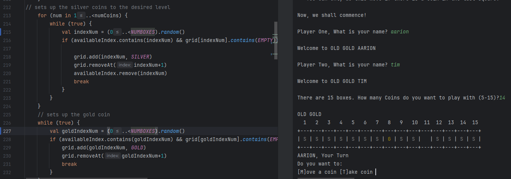

# Development Log

The development log captures key moments in your application development:

- **Design ideas / notes** for features, UI, etc.
- **Key features** completed and working
- **Interesting bugs** and how you overcame them
- **Significant changes** to your design
- Etc.

---

## Date: 06/04/2025

when you tried to move a coin one space, the program automatically didn't like it and says you cant move it there as there
are no available spaces. So to fix this I changed one of my lines from if (!grid.sliced(coinDestination, movingCoinIndex).contains(EMPTY)) {
to if (!grid.subList(coinDestination, movingCoinIndex).contains(EMPTY)) { which fixed the problem.

---

## Date: 08/04/2025

I added the number of the cells above every cell, so the user can more easily locate what cell contains the coin they want to move

---

## Date: 28/04/2025

found a bug in testing that did not allow for the coin to be placed in last square.

before 
after 

---

## Date: xx/xx/20xx

Example description and notes. Example description and notes. Example description and notes. Example description and notes. Example description and notes. Example description and notes.

---