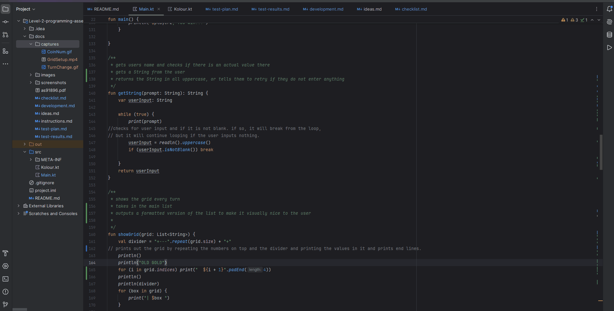
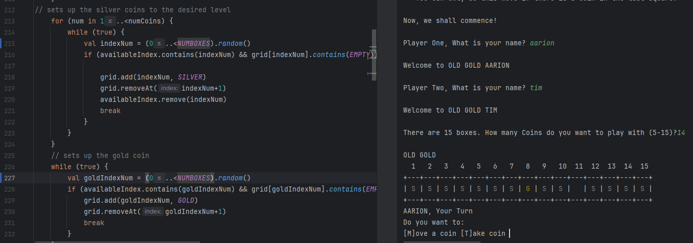
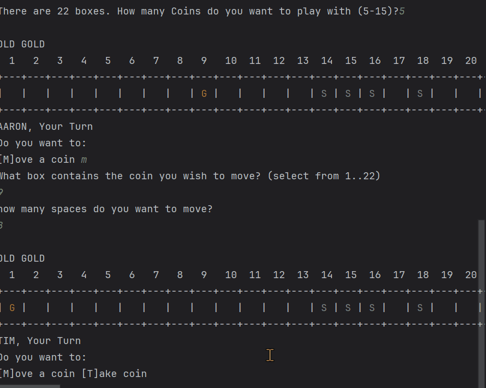
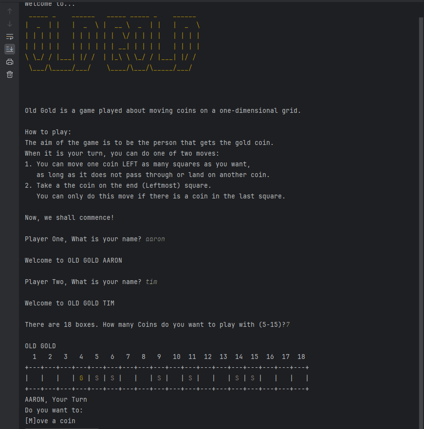
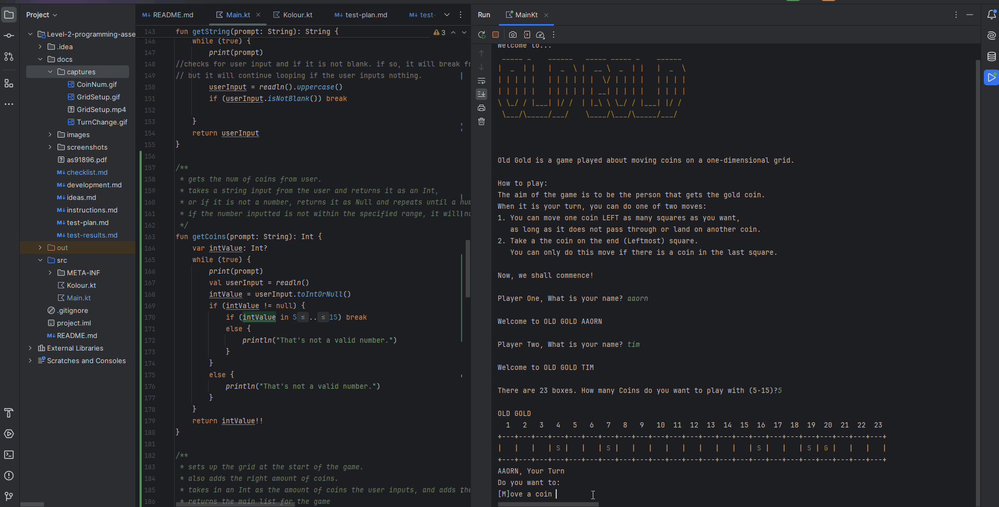

# Results of Testing

The test results show the actual outcome of the testing, following the [Test Plan](test-plan.md)

---

## Coin input

Test to check if the user can input a valid amount of coins to play with, within the set boundaries (5-15). Test if other invalid data is not allowed by program.

### Test Data Used: 4,5,15,16,(blank), thh

Using these values will allow me to check if my boundaries (5 and 15) still work, and it will allow me to see if how the program will handle a number out of range, and how it will handle blanks/non-integers

### Test Result

The program worked as expected. When I entered the in bound numbers, it allowed it to pass, and it did not allow out of bound or non-integer inputs. 
This is what I expected to happen and my program easily handled the invalid errors

---

## Grid set-up

This is a test to make sure that the grid is initially set up with the correct num of coins and can handle edge tests (coin in the last slot, and first slot)

### Test Data Used

I will run the program multiple times, making sure the grid displays the right amount of coins as the user inputs,
and I will use different numbers of coins each time.

### Test Result

every time the grid was set up, it was able to handle the right amount of coins, and add them randomly to the grid. it also managed to handle placing coins in the first and last squares. This is what I expected to happen.

---

## Game end

This is a test to make sure that the game ends and displays the right winner

### Test Data Used

I will run the game multiple times to make sure displays the correct winner every time

### Test Result

every time the game ended, the program correctly detected the correct winner, and displayed their name and told us that they won, just
as I expected.

---

## Turn Change

This is to test if the current player is changing between 1 and 2.

### Test Data To Use

I will take a few turns to check if it always tells me who's turn it is

### Test Result

every single time, after each player finished their turn, it consistently changes the player to the other player. This is what I expected to happen.

---

## Player moves

This is a test to make sure that when a player moves or takes a coin, it moves the coin the right amount or takes the right coin

### Test Data To Use

I will do three different valid moves (one space, the maximum spaces the coin can move, and one in between), and take three different coins (at least one gold coin) to make sure it works every time.
I will also try to input some invalid turn choices, like (blank), 5, and b.
I will also try to take a coin when you can not and move a coin that isn't there and try to move a coin a negative amount and
try to move a coin onto another coin and try to move a coin past another coin and try to move the coin in box 1.

### Test Result

when I did the valid moves, they moved the right coin the right amount of spaces, and always took the coin in the last box.
when I tried the invalid turn choices, they all got rejected by the program, and it handled them well, and asked them to try again.
when I tried to take a coin when there is none in the first box, it did not allow the user to do that, and told them to try a different move.
when I tried to move a coin that isn't there, my program easily handled the error and told the user that they cannot move a coin that isn't there and asked them for a different move.
when I tried to move a coin a negative amount, the program told the user that that is an invalid move and asked them for a new move.
when I tried to move a coin onto and past another coin, my program told the user that it cannot do that move as there was a coin in the way, and asked them for a different move.

---

## Take a coin

This is to test if taking a coin works in all allowed situations

### Test Data To Use

I will take a coin when there is a silver coin there, a gold coin there, and will try to take one when there is no coin there.

### Test Result

When I took a silver coin, the silver coin disappeared, and was replaced by an empty space, so the coin was taken. 
When I took the gold coin, the gold coin disappeared, and was replaced by an empty space, so the coin was taken.
When I tried to take a coin that wasn't there, it told me I could not take a coin.
All these results line up with what I expected to happen, and my program easily handled the unexpected, invalid inputs.

---